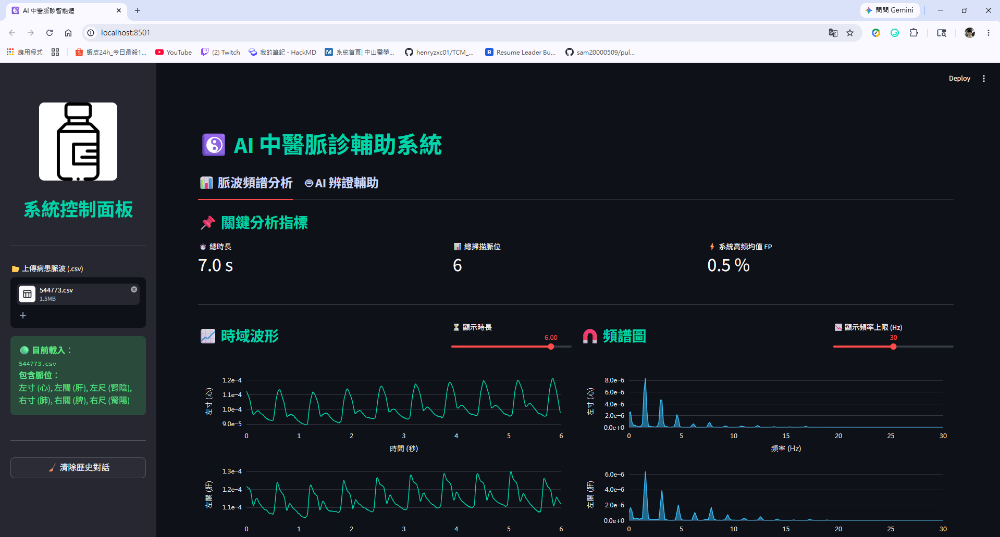
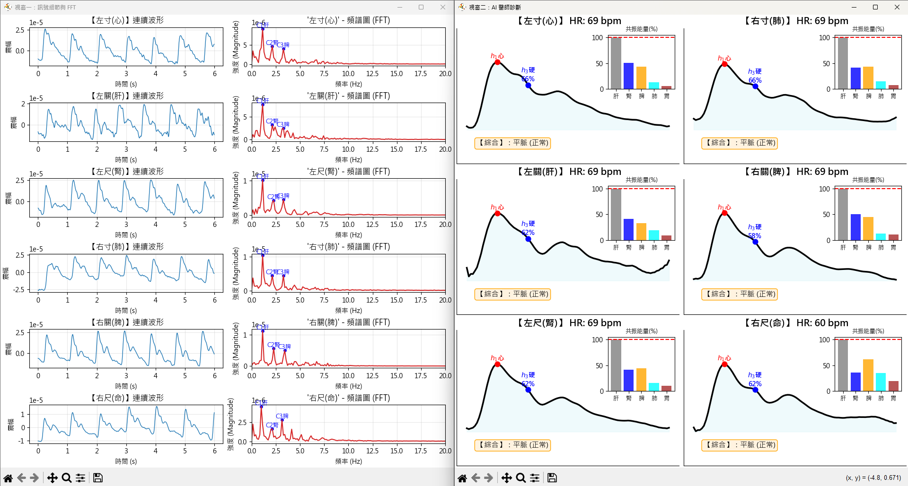

# Medical Signal Analysis Platform

Python project for pulse signal analysis using digital signal processing (DSP), FFT-based feature extraction, and data visualization.
The project also includes an agent-based workflow for result review and report generation.

## Overview

This project focuses on analyzing pulse waveform data and turning raw time-series signals into structured results for review.
The workflow includes signal preprocessing, feature extraction, visualization, and output reporting.

The project was built to improve the readability and consistency of pulse signal analysis and to provide a clearer way to review waveform data.

## Main Functions

* Load and process pulse signal data
* Apply preprocessing to reduce noise and improve signal quality
* Extract FFT-based features from time-series waveforms
* Visualize waveform and analysis results
* Generate structured analysis outputs for review

## Tech Stack

* Python
* Pandas
* NumPy
* SciPy
* Streamlit
* Plotly

## Project Structure

* `app.py` : main application entry
* `assets/` : screenshots and demo images
* `data/` : sample data for testing
* `old_files/` : previous files kept for reference

## How to Run

```bash
pip install -r requirements.txt
streamlit run app.py
```

## Demo

### Dashboard



### FFT Result



## Demo Video

* [Demo Video 1](https://drive.google.com/file/d/1NBIMYn4uCuizNs2Kl3369uNRXSrkIVWs/view?usp=drive_link)
* [Demo Video 2](https://drive.google.com/file/d/1EBWYIKtmJdySBYV__LU2fhjuQixm8KhI/view?usp=drive_link)

## Notes

This project is intended for signal analysis practice, workflow demonstration, and visualization of pulse waveform data.
